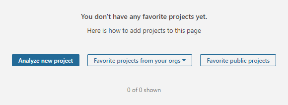
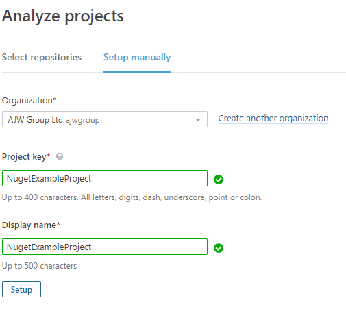
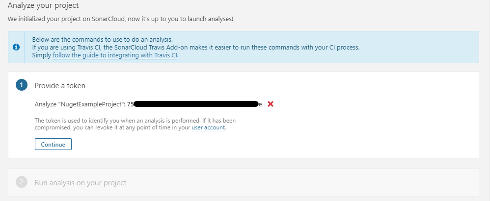
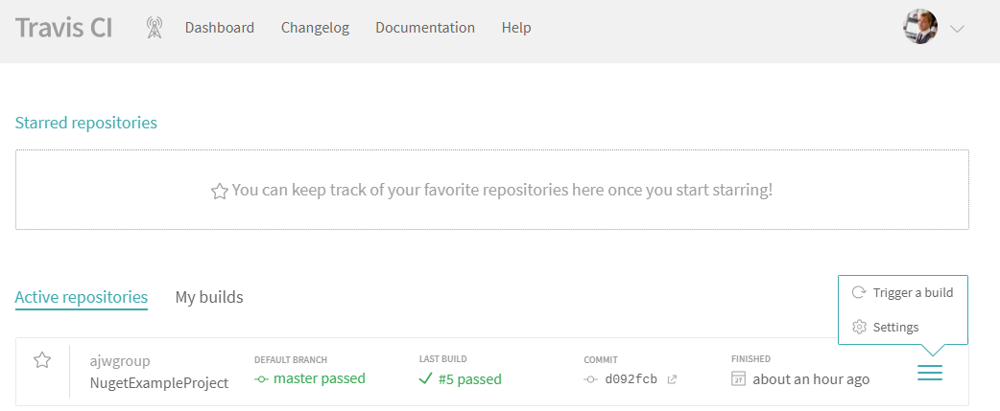
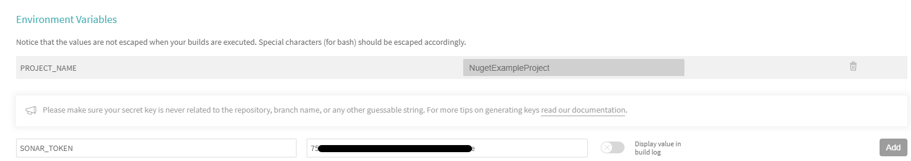

# Nuget Example Project

An example project for a NuGet Package with code coverage, code quality and auto-deploy to nuget.

## Travis-CI

The continuous integration platform used is [Travis-CI](https://travis-ci.com).

There are several variables that need to be set to allow Travis to work correctly with automated builds.

### Setting Environment Variables in Travis-CI

To set environment variables within travis CI follow [this guide.](https://docs.travis-ci.com/user/environment-variables/#defining-variables-in-repository-settings)

### PROJECT_NAME

An essential variable that is required is the `PROJECT_NAME` variable. This is used to specify the project name for the project and allows for all references to the project name to be updated once from within the CI.

This variable should be set to the project name displayed at the end of the github url - <https://github.com/ajwgroup/NugetExampleProject>

### NUGET_KEY

To be able to push the package to nuget in the deployment stage, the `$NUGET_KEY` needs to be set.

The `$NUGET_KEY` can be created by selecting 'API Keys' from the account menu drop down on the nuget website.

From here give the key a friendly name and set the key duration (This is 365 days by default).

If the package has already been published you can select an Available package, or you can specify a Glob pattern for the package(s) that you would like the API key to apply to. It's adviced to create a key for each package that is to be published so that keys can be revoked on a per package basis.

Once the token has been obtained add it to the CI variables as instructed above with the Key name `$NUGET_KEY`.

## Code Coverage

[Codecov](https://codecov.io/gh/ajwgroup/NugetExampleProject) is used for displaying the projects test code coverage.

Code coverage can be seen [here](https://codecov.io/gh/ajwgroup/NugetExampleProject).

**No variables need to be set for the code coverage to published.**

## SonarCloud

[SonarCloud](https://docs.travis-ci.com/user/sonarcloud/) is used to analyse the code and provide feedback on several aspects such as code quality, bugs, potential vulnerabilities among others.

The sonarcloud token should be set to the key `$SONARCLOUD_TOKEN`.

## Github Pages

[Guide to deploy to github pages](https://docs.travis-ci.com/user/deployment/pages/)

## Badges

For a consistent look it's recommended to use badges available from [shields.io](https://shields.io). Example Badges can be seen below.

- 
- 
- 
-  **Package not published**
-  **Package not published**
- 
- 
- 

## ToDo

- [ ] Add in automated documentation generation
- [ ] Generate a visual studio template project